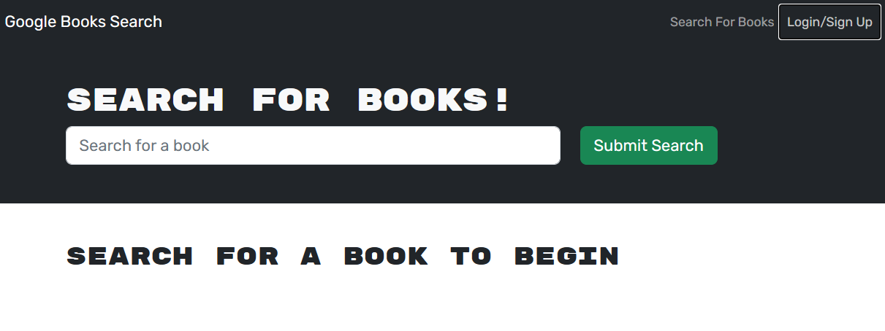
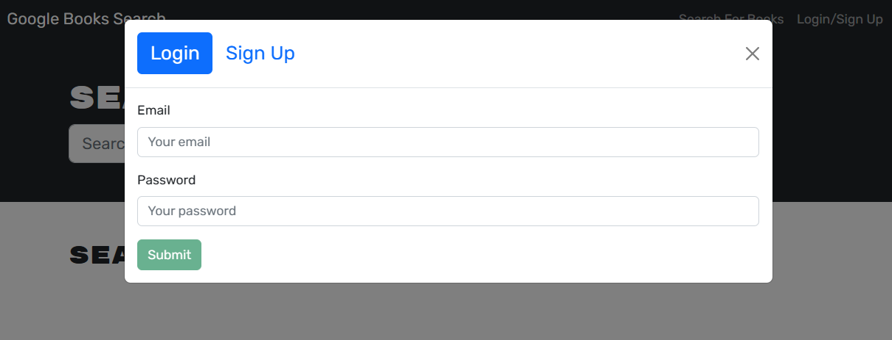
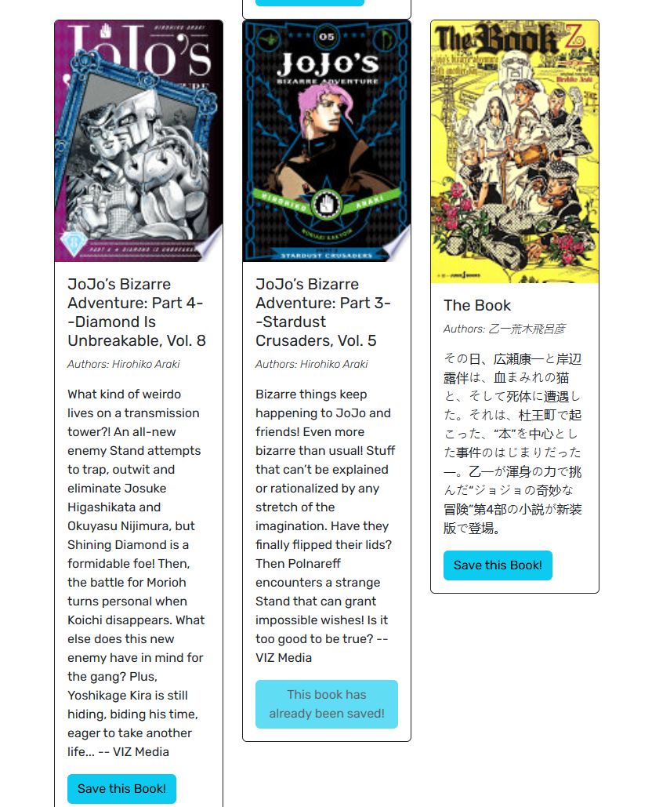
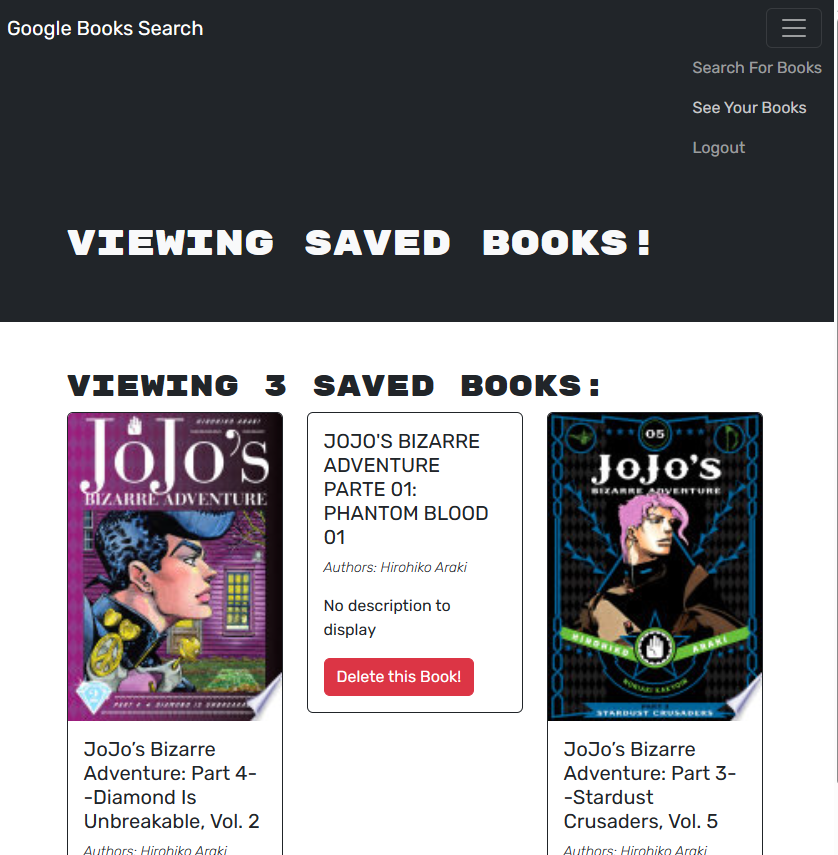

# Books-R-Babes
  [](https://opensource.org/licenses/MIT)

  This project was a refactoring of code for a book search/storage application from a restful API to a GraphQL API ran app.

  ---

  ## Table of Contents:
  * [Installation](#installation)
  * [Usage](#usage)
  * [License](#license)
  * [Contributing](#contributing)
  * [Tests](#tests)
  * [Questions](#questions)

  ---

  ## Installation:
  To install the dependencies needed, open the console from root and run:
  ```md
  npm i
  ```

  ---

  ## Usage:
  From root: 
  ```md
  npm run build 
  npm run develop
  ```
  -or- 
  ---
  to just view and interact with the app, visit the link below:
  > https://books-r-babes.herokuapp.com/


  
  ```md
  The home page allows you to search for books. You cannot save any unless you sign up/login
  ```

  
  ```md
  When you click "Login/Sign Up" you will be prompted to enter your information. If you have not visited the page before, you must sign up in order to get every feature the app offers.
  ```
  
  
  ```md
  From the "SEARCH FOR BOOKS!" book input- you can search for any book title and it will return you a list of results you can then save to your account that you might want to read later. 
  
  *Click the "See Your Books" link on the top right of the page in order to view the books you have saved*
  ```
   
  
  ```md
  If you have read the book, or have changed your mind, you are able to delete the book from your page.
  ```
  
  ---

  ## License:
  The MIT License (MIT)

      Copyright (c) undefined undefined
      
      Permission is hereby granted, free of charge, to any person obtaining a copy of this software and associated documentation files (the "Software"), to deal in the Software without restriction, including without limitation the rights to use, copy, modify, merge, publish, distribute, sublicense, and/or sell copies of the Software, and to permit persons to whom the Software is furnished to do so, subject to the following conditions:
      
      The above copyright notice and this permission notice shall be included in all copies or substantial portions of the Software.
      
      THE SOFTWARE IS PROVIDED "AS IS", WITHOUT WARRANTY OF ANY KIND, EXPRESS OR IMPLIED, INCLUDING BUT NOT LIMITED TO THE WARRANTIES OF MERCHANTABILITY, FITNESS FOR A PARTICULAR PURPOSE AND NONINFRINGEMENT. IN NO EVENT SHALL THE AUTHORS OR COPYRIGHT HOLDERS BE LIABLE FOR ANY CLAIM, DAMAGES OR OTHER LIABILITY, WHETHER IN AN ACTION OF CONTRACT, TORT OR OTHERWISE, ARISING FROM, OUT OF OR IN CONNECTION WITH THE SOFTWARE OR THE USE OR OTHER DEALINGS IN THE SOFTWARE.

  ---

  ## Contributing:
  N/A - There is no way to contribute to this application at this time.

  > SHOUT-OUTS: I would like to appreciate George Yoo and Ben Sboto for helping me find my tiny errors that broke my entire code. You saved me so much time and many headaches! 

⠻⢿⣿⡀⢀⠾⣿⡹⢧⣛⢧⣟⡏⣼⢻⣽⣻⣿⣿⣿⣿⢿⢹⣳⡻⣿⣿⡟⢸⣽⢳⣻⣿⣿⣿⣿⣿⣿⣞⠩⣿⡼⣇⣿⣇⠠⢻⣧⢂⢣⢻⣿⣿⣿⣷⣙⣿⣿⣿⣇
⠠⠈⢀⡾⣛⡿⣝⡳⣏⢿⣽⢠⣟⢻⣷⣿⣿⠿⣛⣯⠏⣳⢷⡻⣽⢞⠅⣻⢸⣏⣷⢻⡼⣏⡿⣏⡿⣽⡂⣽⡃⣯⢟⣻⠀⢃⢿⣎⡆⢏⣿⣿⣿⣿⣿⠹⣿⣿⣿
⠡⢀⡾⡵⣏⡿⣱⢯⡽⣾⡌⣴⣋⣾⣿⠟⣡⢟⡾⠅⢸⣛⡾⣝⣧⡟⢀⡏⢰⣻⡼⢯⡷⣏⡷⣏⡇⣳⠇⣳⡅⢯⣛⡷⠂⠘⡖⢻⡶⡘⣞⣶⢲⣭⣛⠇⢿⣿⣿
⠀⣸⢳⣝⡞⣷⢫⣷⣽⣼⡁⡷⣭⣿⢋⡾⢁⣮⠇⡄⡿⣭⡟⣽⢶⡃⢸⡇⢸⣳⣻⢻⡼⣏⡷⣏⣇⢽⡃⡷⡆⣹⣏⡇⡀⣇⢹⡈⡷⣇⠻⣼⣛⡶⢯⣗⠘⣿⢿
⠀⣯⢻⡼⣹⣷⣯⣾⣿⣿⠁⣇⣿⡿⢸⠃⣸⡞⢰⠸⣝⣧⢿⣹⡞⢱⢸⡅⠸⣧⡟⣯⣗⢯⡽⣝⡞⢸⣁⡷⡇⢼⢧⡃⡇⣿⡄⣷⠸⣳⠈⡷⢯⣽⣛⡎⡀⣿⣫
⢰⣏⢷⡻⣷⣿⢿⣿⣿⣿⠀⡇⡿⡽⡇⢠⢷⡃⡌⣾⡽⢾⣹⢮⡅⡎⢸⠃⡀⣷⣻⢷⣞⡯⣟⡾⡅⢻⢠⢿⡅⡾⢋⢀⡇⡻⣷⢸⡅⢹⡇⢹⣛⡶⣏⡯⠇⣷⣫
⢸⣞⣳⣿⣿⣿⣿⣿⣿⡿⢀⠇⣿⡽⠀⡼⣯⢡⢃⡷⠻⠯⠛⢋⢐⡃⣋⢀⡃⣁⣉⣉⣉⠛⣽⣳⠆⡏⢸⢯⢰⡇⡞⢸⢂⢿⣮⡌⣯⠈⣿⡀⢸⣳⢯⣽⢂⡷⢯
⣻⣿⣿⣿⣿⣿⢺⣿⣟⡟⢠⠘⣷⠏⠀⣿⠃⣋⢨⡶⣶⢯⡟⡈⣼⡇⡟⣼⡇⠀⣿⡿⣽⡇⣿⡽⢰⠃⣾⠇⣾⢰⢣⢸⢘⣓⠋⠃⠿⡀⡸⡇⠆⣿⣿⢾⣸⢼⣻
⣿⣿⣿⡟⠙⠻⣸⢷⡾⣹⠀⠘⣯⠂⢸⣯⠁⡏⢸⡽⣞⡷⢰⢡⣿⢃⠇⣿⣿⠀⣿⣿⣽⠰⣯⡇⡞⢠⡿⢰⠃⡎⣾⠘⣾⣿⣿⣷⢠⠄⣅⠛⠀⢹⣯⣿⢸⣻⢷
⣿⣿⡟⣼⡀⠜⣯⣟⣳⣟⠀⠀⣿⡀⣼⡳⠀⣇⢸⡿⡽⢃⢃⣿⡿⡘⢐⣻⢿⠀⣿⣳⡏⢸⣷⠃⢀⣾⢡⠇⡸⣸⡏⢠⣿⣿⣿⣷⢸⢢⣿⡸⢠⢘⠻⣽⢸⣿⡏
⢹⣿⢰⣟⣇⢂⠰⣯⢷⢯⡀⠄⢟⠀⣷⡇⢲⠹⠘⠁⠁⠀⠀⠉⠁⠁⠹⣻⣿⠀⢹⣿⠇⣾⠇⢀⡾⢡⢪⢆⢳⣿⠃⡾⣛⣛⡿⠿⢸⢸⣿⣇⠃⢸⣿⣮⠈⣷⠇
⠸⣧⠸⣻⢾⡄⠂⢹⣞⣟⡆⠀⢬⠀⠋⠀⠀⠀⠀⢀⠠⠀⡔⠠⠰⣶⣦⣤⣉⠀⡀⣿⢡⡿⢠⡞⠁⣵⠏⣠⣿⠃⣼⠯⠛⠋⠙⠛⠘⠸⠟⣿⠀⢸⣿⢾⢰⣿⢀
⠀⢻⡄⢫⣟⢷⡘⡀⢹⡞⣷⡀⠸⠈⠀⢀⣤⠐⡂⢌⡘⢡⢈⣱⠂⢿⣿⣿⣿⣤⣧⣄⡜⠡⠋⣠⣾⣟⣰⣿⣯⣾⡇⠀⡀⠠⣀⠀⢀⠀⠈⠛⠇⢽⣿⡇⣼⡏⣸
⡆⠈⢳⡄⠻⣎⠳⣌⠀⠙⣍⣁⠀⠀⠀⣾⣷⠠⣵⡀⢘⡀⣼⢣⠇⢸⣿⣿⣿⣿⣿⣿⣿⣿⣿⣿⣿⣿⣿⣿⣿⣿⠰⠠⢌⡁⢄⢋⡈⣷⣄⠀⠀⠠⣴⢠⡿⢱⣻
⠈⡅⠀⠘⢄⠈⠳⡝⢦⡂⠈⠛⣧⡘⣦⡙⢿⡄⢳⣟⡟⡾⣭⡐⢿⣿⣿⣿⣿⣿⣿⣿⣿⣿⣿⣿⣿⣿⣿⣿⣿⣿⢰⠈⠆⢰⣊⢦⠅⣿⣿⣇⠀⠀⠁⡾⢁⣿⠍
⠀⠆⣴⡶⢀⠁⠀⠈⠳⣍⠂⡀⠀⠑⠈⠿⣷⣿⣦⣨⣭⣥⣴⣶⣿⣿⣿⣿⣿⣿⣿⣿⣿⣿⣿⣿⣿⣿⣿⣿⣿⣿⡈⡷⣖⣿⢚⣍⣰⣿⣿⠇⡠⠂⠔⢠⡾⠋⡰
⡘⠠⣿⢸⢻⠛⡖⡀⠤⡈⠛⠒⠤⡀⠑⣶⣌⣙⣻⣿⣿⣿⣿⣿⣿⣿⣿⣿⣿⣿⣿⣿⣿⣿⣿⣿⣿⣿⣿⣿⣿⣿⣷⣦⣍⡈⢃⣹⣿⣿⣯⣾⠀⠀⠴⠋⠁⡴⠁
⣃⠀⣿⡈⣿⡆⢹⠀⢶⣥⣉⠒⠄⠀⢠⣝⡻⣿⣿⣿⣿⣿⣿⣿⣿⣿⣿⣿⣿⣿⣿⣿⣿⣿⣿⣿⣿⣿⣿⣿⣿⣿⣿⣿⣿⣿⣿⣿⣿⣿⣿⡇⠠⡔⠀⢌⠊⢀⡀
⣻⠀⠘⢷⣬⡳⣈⡁⢸⡾⣝⡿⡆⣮⠈⣿⣿⣿⣿⣿⣿⣿⣿⣿⣿⣿⣿⣿⣿⣿⣿⣿⣿⣿⣿⣿⣿⣿⣿⣿⣿⣿⣿⣿⣿⣿⣿⣿⣿⣿⣿⢀⠓⢀⡜⢬⠇⠸⡄
⡟⣆⢄⠀⠙⢿⣮⣕⠸⣽⣫⢷⢁⣿⠀⣿⣿⣿⣿⣿⣿⣿⣿⣿⣿⣿⣿⣿⣿⣿⣿⣿⣿⡿⠿⣿⣿⣿⣿⣿⣿⣿⣿⣿⣿⣿⣿⣿⡿⢿⡏⣠⢡⣞⡟⡏⠀⣇⠇
⣳⠈⡌⡴⣄⡀⠙⠿⢠⢿⣵⡏⢸⣽⠀⢸⣿⣿⣿⣿⣿⣿⣿⣿⣿⣿⣿⣿⣿⣿⣿⢟⣫⣾⣿⣶⣝⡿⣿⣿⣿⣿⣿⣿⣿⡿⣟⣵⣿⣷⡅⢡⣟⡾⡽⠐⢰⣊⢧
⢽⡆⠰⠀⢻⣳⡄⠀⠘⣿⣞⠇⣟⣾⠁⢸⣿⣿⣿⣿⣿⣿⣿⣿⣿⣿⣿⡿⢟⣯⣾⣿⣿⣿⣿⣿⣿⣿⣶⣔⠙⣿⣿⡿⣫⣾⣿⣿⣿⢿⣿⣦⡙⡾⢡⠃⢦⡙⣮
⡀⠻⣄⠣⠈⢷⣻⡄⠈⣷⡟⢨⣟⣾⠀⡇⠻⣿⣿⣿⣿⣿⣿⡿⢫⣵⣶⣿⣿⣿⣿⣿⣿⢏⣽⣛⠿⣿⣿⡿⠼⣿⠏⣾⣿⣿⢋⡋⠘⣿⣿⣿⣿⣦⡙⢰⢢⡝⣳
⠐⠄⡈⠂⡡⠀⢻⣽⠀⣿⠇⣼⣟⡾⠈⣇⢸⣮⡛⢿⣿⠟⣡⣾⣿⣿⣿⣿⣿⣿⠿⣫⣿⣿⣿⣿⣷⡘⢿⡀⠀⠁⢀⣾⢟⡵⠋⠀⡇⢈⠻⠯⣿⡿⣻⣦⣬⣘⠳
⠈⠰⠠⠁⠄⠁⠀⠹⡀⣿⢀⣿⣿⣽⠃⣯⠀⢿⡿⢃⣴⣿⣿⣿⣿⣿⣿⣿⣿⣿⣷⣭⡻⢿⣿⣿⣿⣿⣮⣑⣀⣤⣭⡷⠋⠀⠀⢰⢁⡾⣷⠀⣩⣾⣿⣿⣿⣿⣿
⠀⠀⠐⠠⠈⡐⠀⠀⠀⡏⣼⣿⣿⣯⡇⣿⠄⣠⣴⣿⣿⣿⣿⣿⣿⣿⣿⣿⣿⣿⣿⣿⣿⣷⣍⣻⢿⣿⣿⣿⡿⠟⠁⠀⠀⠀⠀⠼⣸⡽⡞⣰⣿⣿⣿⣿⡿⣿⣿
⠀⠀⠀⠡⡁⢄⡈⠐⠀⠃⣿⣿⣿⡿⢃⣡⣾⣿⣿⣿⣿⣿⣿⣿⣿⣿⣿⣷⣍⠛⠿⢿⣿⣿⣿⣿⣷⣝⠛⠁⠀⠀⠀⠀⠀⠀⠀⡇⣟⢎⣼⣿⣿⣿⠟⠉⣴⣿⣿
⠀⠀⠀⢀⡁⠂⠐⠡⠂⢠⣿⠟⣫⣴⣿⣿⣿⣿⣿⣿⣿⣿⣿⣿⣿⣿⣿⣿⣿⣷⣦⣀⠈⠛⢿⣿⣿⣿⣿⣦⡀⠀⠀⠀⠀⠈⠀⡿⢣⣾⣿⣿⠟⢡⢎⣾⣿⣿⣿
⠀⠀⠀⠀⡐⡀⠀⠀⠀⠘⣡⣾⣿⣿⣿⣿⣿⣿⣿⣿⣿⣿⣿⣿⣯⣟⡿⣿⣿⣿⣿⣿⣿⣦⡀⠈⠻⢿⣿⣿⣿⣦⡀⠀⠀⠀⠀⢃⣿⣿⡿⠁⠀⢠⣿⣿⣿⣿⣿
⠀⠀⠀⠀⢄⠡⡁⢆⢀⣿⣿⣿⡿⢿⣿⣿⣿⣿⣿⣿⣿⣿⣿⣿⣿⣿⣿⣶⣽⡻⢿⣿⣿⠟⠀⠀⠀⠀⠙⠻⣿⣿⣿⣄⠀⠀⢠⣿⣿⠟⣽⡅⠀⢜⡿⡿⣻⣿⣿
⠀⠀⠀⠀⠐⠢⠁⠀⠘⡉⢉⠀⡀⠀⠙⠛⠿⠿⠿⠛⠿⠋⠉⠛⠛⠻⢿⣿⣿⡿⠀⠀⠀⠀⠀⠀⠀⠀⠀⠀⠈⠻⣿⡟⠁⠀⠁⢈⠏⣶⢹⠆⠀⠀⠉⠀⠹⢿⡿
⠀⠀⠀⠀⠀⠀⠀⠀⢡⠐⡈⠰⢀⠂⠄⠀⠀⠀⠀⠀⠀⠀⠀⠀⠀⠀⠀⠀⠉⠀⠀⠀⠀⠀⠀⠀⠀⠀⠀⠀⠀⠀⠈⠙⠂⠀⢀⣪⣶⡹⡎⡇⠀⠀⠀⠀⠀⠀⠀
⠀⠀⠀⠀⠀⠀⠀⠀⠠⢂⠁⠆⢡⠈⢂⠡⢂⠐⡀⠆⡐⠀⠀⠀⠀⠐⠀⢀⠀⠀⠀⠀⠀⠄⠀⠀⠀⠀⠀⠀⠀⠀⠀⠀⠀⠀⠀⢿⣿⣿⡕⡀⠀⠀⠀⠀⠀⠀⠀
⠀⠀⠀⠀⠀⠀⠀⠀⠐⢂⠉⡐⢂⠡⠌⡐⢂⠡⠐⠂⡔⠀⢠⠀⠄⡀⢂⠀⠀⠀⠀⠄⠂⠀⠀⠀⠀⠀⠀⠀⠀⠀⠀⠀⠀⠀⠀⠈⢷⣿⣿⣆⠀⠀⠀⠀⠀⠀⠀
⠀⠀⠀⠀⠀⠀⠀⠀⠐⡈⠤⢁⠂⠆⢂⡁⠆⣈⠡⠡⣀⠃⠀⢧⠐⠁⠀⡀⠆⡐⠠⢀⠀⡀⠁⠀⠀⠀⠀⠀⠀⠀⠀⠀⠀⠀⠀⠀⠀⠻⣿⣿⣷⣄⠀⠀⠀⠀⠀

  ---

  ## Tests:
  N/A

  ---

  ## Questions:
  If you have questions, you may contact me on [GitHub](https://github.com/d-lil) or you may reach out by contacting Daniel Liljegren at dahneel@gmail.com
